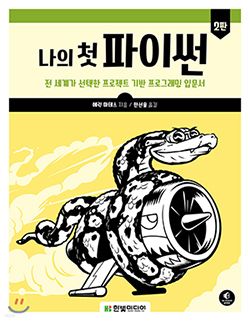

  <a href="https://ut-aaronkr.github.io/python-crash-course" title="Home">🏠</a> |
  <a href="/01.html" title="Getting Started / 시작하기">01</a> |
  <a href="/02.html" title="Variables & Data Types / 변수와 데이터 타입">02</a> |
  <a href="/03.html" title="Lists 1 / 리스트 1">03</a> |
  <a href="/04.html" title="Lists 2 / 리스트 2">04</a> |
  <a href="/05.html" title="If Statements / 조건문">05</a> |
  <a href="/06.html" title="Dictionaries / 사전">06</a> |
  <a href="/07.html" title="User Input / 사용자 입력">07</a> |
  <a href="/08.html" title="Functions / 함수">08</a> |
  <a href="/09.html" title="Classes / 클래스">09</a>

---

This repository contains the course materials for the [Python Crash Course](https://ut-aaronkr.github.io/python-crash-course/) taught in Summer 2023 by Aaron Snowberger. / 이 저장소에는 에런 스노버거가 2023년 여름에 가르치는 [나의 첫 파이썬](https://ut-aaronkr.github.io/python-crash-course/)의 강의 자료가 포함되어 있습니다.

### Instructor / 강사

- Aaron Snowberger ([aaronkr.trainer@gmail.com](aaronkr.trainer@gmail.com)), Graduate School of Information & Communications Engineering, Hanbat University
- 에런 스노버거, 정보통신공학과, 한밭대학교

## Important Specifics / 중요한 세부 사항

### Computer Software / 소프트웨어

The software we will be using is listed below. 수업에서 사용할 소프트웨어가 다음과 같다.

- [Python](https://www.python.org/downloads/) (version 3.9.1 or higher)
- [Visual Studio Code](https://code.visualstudio.com/download)
- [VS Code Python Extension](https://marketplace.visualstudio.com/items?itemName=ms-python.python)

### Textbook / 주제책

| Textbook                                                                 |
| :----------------------------------------------------------------------- |
|                                      |
| Eric Matthes 저 / 한선용 역 (2020년 07월 01일)                           |
| [_나의 첫 파이썬_ (Yes24)](https://www.yes24.com/Product/Goods/90900588) |
| No Starch Press (한빛미디어 번역).                                       |

## Course Topics / 과정 화제

| Chp | 화제                                                    |
| :-: | :------------------------------------------------------ |
|  1  | [Getting Started / 시작하기](/01.html)                  |
|  2  | [Variables & Data Types / 변수와 데이터 타입](/02.html) |
|  3  | [Lists 1 / 리스트 1](/03.html)                          |
|  4  | [Lists 2 / 리스트 2](/04.html)                          |
|  5  | [If Statements / 조건문)](/05.html)                     |
|  6  | [Dictionaries / 사전](/06.html)                         |
|  7  | [User Input / 사용자 입력](/07.html)                    |
|  8  | [Functions / 함수](/08.html)                            |
|  9  | [Classes / 클래스](/09.html)                            |

### Instructor / 교수

**Aaron Snowberger** is a PhD candidate majoring in Information and Communications Engineering at Hanbat National University in Korea. He also holds degrees in Computer Science and Media Design. He has taught high school technology courses for over 6 years, and has built dozens of web applications with Node and Express. His current research interests include computer vision, natural language processing, image processing, signal processing, and machine learning.

Aaron Snowberger는 한밭대학교 정보통신공학과 박사과정 수료했으며, 컴퓨터 공학 및 미디어 디자인 학위를 보유하고 있습니다. 그는 6년 이상의 고등학교 기술 교육 과정을 가르치고 있으며, Node 및 Express를 사용하여 수십 개의 웹 애플리케이션을 구축했습니다. 현재 연구 관심사는 컴퓨터 비전, 자연어 처리, 영상 처리, 신호 처리 및 기계 학습입니다.
