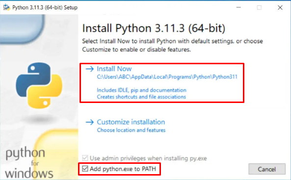
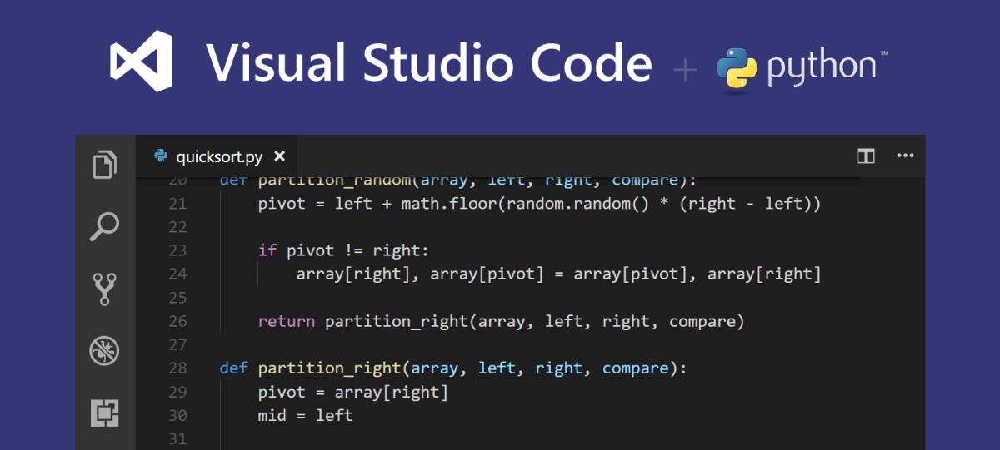

<p id="menu" align="center">
  <a href="https://ut-aaronkr.github.io/python-crash-course" title="Home">🏠</a> |
  <a href="01.html" title="Getting Started / 시작하기">01</a> |
  <a href="02.html" title="Variables & Data Types / 변수와 데이터 타입">02</a> |
  <a href="03.html" title="Lists 1 / 리스트 1">03</a> |
  <a href="04.html" title="Lists 2 / 리스트 2">04</a> |
  <a href="05.html" title="If Statements / 조건문">05</a> |
  <a href="06.html" title="Dictionaries / 사전">06</a> |
  <a href="07.html" title="User Input / 사용자 입력">07</a> |
  <a href="08.html" title="Functions / 함수">08</a> |
  <a href="09.html" title="Classes / 클래스">09</a>
</p>

---

## Getting Started / 시작하기

### 1.1 Install Python / 파이썬 설치

[Download Python](https://www.python.org/downloads/)

[](https://www.python.org/downloads/release/python-3114/)



### 1.2 Install VS Code / VS Code 설치

[Download VS Code](https://code.visualstudio.com/download)

- [VS Code Python Extension](https://marketplace.visualstudio.com/items?itemName=ms-python.python)



### 1.3 Confirm Python Installation / 파이썬 설치 확인

Open a terminal in VS Code and type `python --version`.<br>
VS Code에서 터미널을 열고 `python --version`을 입력하세요.

```bash
$ python --version
Python 3.9.6
```

#### Use Python in the Terminal / 터미널에서 파이썬 사용

```bash
$ python
Python 3.9.6 (tags/v3.9.6:db3ff76, Jun 28 2021, 15:26:21) [MSC v.1929 64 bit (AMD64)] on win32
Type "help", "copyright", ...
>>> print("Hello World!")
Hello World!
>>> exit()
```

#### Simplify VS Code Output / VS Code 출력 간단하게 만들기

1. Open the Debug tab in VS Code.<br>
   VS Code에서 디버그 탭을 엽니다.
2. Click the gear icon to open `launch.json`.<br>
   톱니바퀴 아이콘을 클릭해서 `launch.json`을 엽니다.
3. Change<br>
   `"console": "integratedTerminal"` to `"console": "internalConsole"`.<br>
   `"justMyCode": True`
4. Save the file and close it.<br>
   파일을 저장하고 닫습니다.

### 1.4 Hello World

```python
# 1.1_hello_world.py
print("Hello World!")
```

In the terminal, type `python 1.1_hello_world.py`.<br>
터미널에서 `python 1.1_hello_world.py`를 입력하세요.

```bash
$ python 1.1_hello_world.py
Hello World!
```
